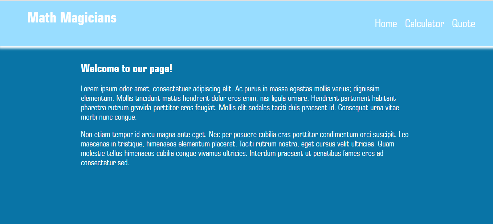

## Math-Magicians
This is a React project, Math-magicians application. It provides the React component that will hold the core functionality: a calculator. Logic is added.





## Built With

- JS
- CSS
- Github
- React

## Live Demo

[Live Demo](https://smart1-hub.github.io/React-Math/)

### Setup
~~~ 
git clone git@github.com:smart1-hub/React-Math.git
cd React-Math
~~~
- Open a index.html file with code editor of your choice and/or a browser.
~~~
Open the project using a live server extension that can be found in your code editor or by using your browser
~~~
- install project dependencies
```
npm install
```
- build project
```
npm run build
```
- start project
```
npm start
```

## Environment Prerequisites

Web Browser

Code editor: Vscode or any other code editor

## Author

👤 **Ademola Adebayo**

- Github: [@Ademola](https://github.com/Smart1-hub)

- Twitter: [@ademola_adebayo](https://twitter.com/ademola_adebayo)

- LinkedIn: [Ademola Adebayo](https://www.linkedin.com/in/ademola-adebayo-81051578/)


## Acknowledgement

- Microvers Org.

## Contributing

Contributions, issues, and feature requests are welcome!

## Show your support

Give a ⭐ if you like this project and how it is built!


## 📝 License

This project is [MIT](https://github.com/microverseinc/readme-template/blob/master/MIT.md) licensed.